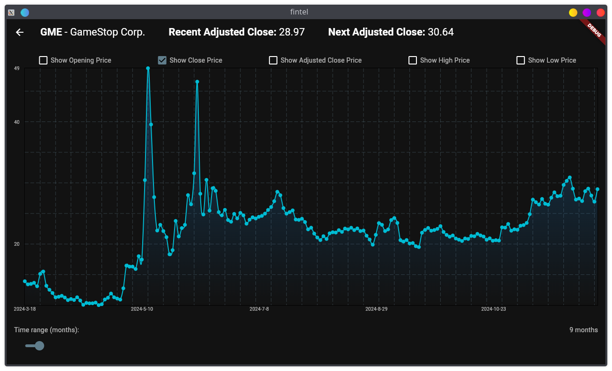

<h1 align="center">
    🌐 Fintel
</h1>

)

**Fintel** is an AI-powered stock analytics dashboard, providing dynamic insights into stock trends through an interactive and cross-platform interface. Built with a Flutter frontend and a Flask backend, Fintel offers accessible, real-time market predictions and data visualization powered by LSTM neural networks.

 

## 📌 Features
- **Real-Time Stock Data**: Live market data pulled directly from a financial API
- **Predictive Insights**: LSTM neural network model for next-day stock price predictions
- **Cross-Platform UI**: Intuitive Flutter-based interface for mobile and web access
- **Scalable Backend**: RESTful Flask API serving model predictions and stock data